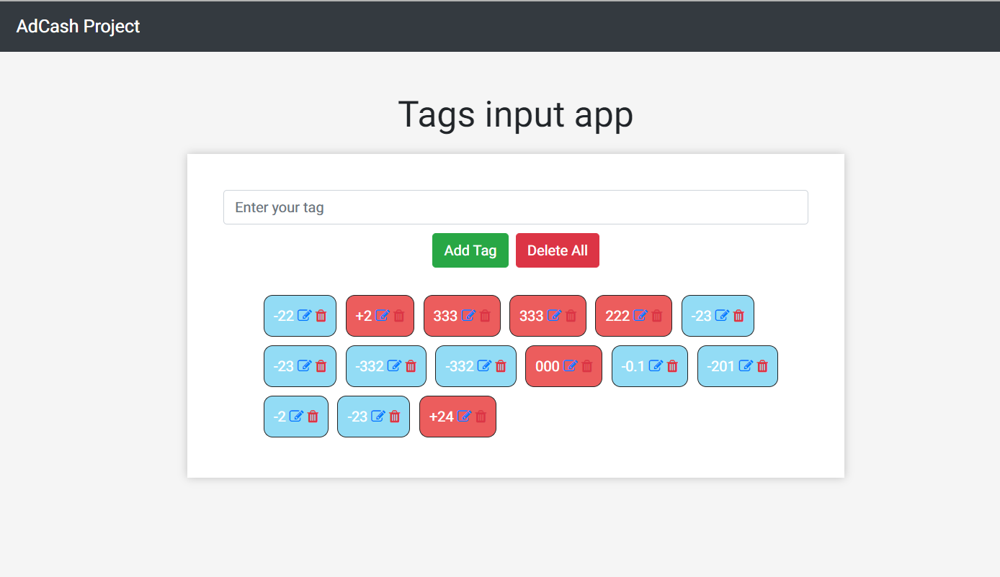
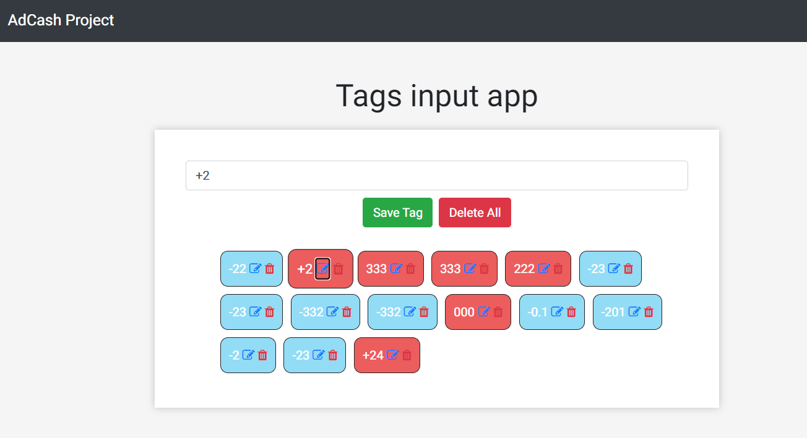

# AdcashTags

Test Assignment for Software Engineering Internship - Front End
* Tags input with CRUD Operations

### Created with: 
* HTML
* CSS (SCSS as the CSS preprocessor)
* Vanilla JS (Tried to use ES6+ syntax)
* NPM for package management

Also used Font-awesome & Bootstrap for faster development 

~~~~
Clone/Fork the repo and run "npm install" on the CLI
* Run "live-server"
* For compiling SCSS: "npm run compile:sass"
~~~~

## Project images

### Adding tags 

* Users can add tags by adding only NUMERIC values to the input
* Tags get added to the list when:
  * Writing "," or ";" to the end of the string or pressing Enter
  * Pressing the button "Add tag"

### Editing tags

* Users can edit tags by pressing the edit icon
  * Pressing "Save Tag" after editing updates the selected tag!

### Deleting tags
* Users can delete tags separately or all with one click!

Code is far from perfect and I can most likely do better, will refactor & improve it when I have free time!
